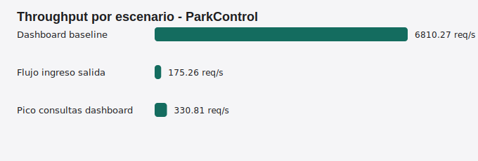

# Evidencia de pruebas de rendimiento - ParkControl

## Equipo Unidad 05

- Yerlinson Maturana Serna
- Brayan Estif Calderon Gomez
- Sadane Geronimo Miguel Santiago Acevedo Virgues
- Julian Camilo Corredor Rojas


## Archivos entregables

- `performance/ParkControl_LoadTest.jmx`: plan de prueba JMeter con escenarios de dashboard, ingreso/salida y pico de consultas.
- `scripts/run-performance-test.js`: runner Node.js reproducible para generar resultados sin depender de interfaz grafica.
- `performance/results/performance-summary.json`: resumen estructurado de metricas.
- `performance/results/performance-summary.md`: tabla de resultados en Markdown.
- `performance/results/performance-results.csv`: muestras detalladas por solicitud.
- `performance/results/throughput-chart.svg`: grafica de throughput por escenario.

## Comandos de reproduccion

```bash
npm start
npm run perf
```

Para pruebas funcionales y cobertura:

```bash
npm test
npm run coverage
```

## Resultado consolidado

| Escenario | Usuarios | Ramp-up | Duracion | Muestras | Throughput | Promedio | P95 | Error |
| --- | ---: | ---: | ---: | ---: | ---: | ---: | ---: | ---: |
| Dashboard baseline | 5 | 5 s | 8 s | 54489 | 6810.27 req/s | 0.46 ms | 0.81 ms | 0% |
| Flujo ingreso salida | 8 | 8 s | 8 s | 1408 | 175.26 req/s | 10.01 ms | 27.84 ms | 0% |
| Pico consultas dashboard | 20 | 5 s | 8 s | 2670 | 330.81 req/s | 40.53 ms | 75.83 ms | 0% |

## Grafica



## Evidencia de estabilidad

La corrida final genero 58567 muestras y 0% de error en todos los escenarios. El archivo CSV conserva cada medicion individual con escenario, usuario, iteracion, metodo HTTP, ruta, estado, duracion y error si existiera.
